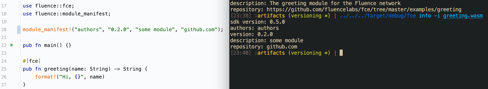

**BWU 1:**

**Quantitative changes:**

1. **Support of references** in the following form:
     ```rust
    #[marine]
    fn foo(arg: &Vec<Vec<u8>>) → Vec<u8>
    ```

    ```rust
    #[marine]
    fn foo(arg: &String) → &String
   ```

    ```rust
    #[marine]
    #[link(wasm_import_module = "module_name")]
    extern "C" {
      fn foo(arg: &Vec<&Vec<&String>>) → Vec<Vec<u8>>;
    }
   ```
    

2. Added **&str** type:
     ```rust
    #[marine]
    fn foo(arg: &str) → &str
    ```
    
   ```rust
    #[marine]
    #[link(wasm_import_module = "module_name")]
    extern "C" {
      fn foo(arg: &Vec<&Vec<&str>>) → Vec<Vec<u8>>;
    }
   ```
   

3. **fce_test** macro

    This macro is intended for test purposes and works in the following way:

    ```rust
    #[fce_test(config_path = "/path/to/config", modules_dir = "/path/to/service/modules/dir")]
    fn test() { 
        let result = greeting.greeting("user");
        assert_eq(result, "Hi, user"); 
    }
   ```

    It internally generates glue code that provides users a way to call a function with `func_name` from a module with name `module_name` by `module_name.func_name(<args>)`.

4. **module_interface** is the new macro that provide capability to embed some information about compiled Wasm module into result binary. Then it could be obtained with help of `fce info`: 

<p align="center" width="100%">
    
</p>


5.  IT was extended with **Boolean** type (in the previous version each bool produces `i32` IT type)


6. IT was extended with **ByteArray** type that is a specialization of Array(u8) type. It optimizes pack/unpack of `Vec<u8>` to IValues. Additionally, three new instructions to IT are added:

   - byte_array.lift_memory
   - byte_array.lower_memory
   - byte_array.size


7. The signature of allocate function exported with help of rust-sdk from each Wasm module was changed in the following form
`pub unsafe fn allocate(elem_count: usize, elem_ty: usize) -> usize`
Now it receives the additional argument that represent element type. It makes the array passing scheme more sustainable by more carefully work with alignments, allowing to use custom allocator in Wasm modules. To support this change from the IT side two new instructions were additionally added:

   - i32.push
   - i64.push


8. **Versioning**. After BWU each Wasm modules contains versions of sdk and IT (they could be obtained by `fce info`) and fce engine checks these versions to be compatible with some minimal supported versions. These versions are embedded automatically while module building.


9. Fce cli and repl check crates.io for updates and print a log message if newer versions were found. 


10. Repl now supports option called `-nr` in calls. It allows not to print a result of execution.


11. The sqlite wrapper was refactored to follow the newest api changes, several memory leaks were fixed.


**Quality changes:**

1. The arrays and records passing scheme was completely refactored that makes it more performant and less memory consuming.
   

2. The IT crate and host closures now share the same new `it-lilo` crate ([https://github.com/fluencelabs/interface-types/tree/master/crates/it-lilo](https://github.com/fluencelabs/interface-types/tree/master/crates/it-lilo)), previously it's a form of code duplicating, because actually they do the similar thing.


3. rust-sdk was a bit refactored to support reference types and the new passing scheme.


4. Deallocate function in rust-sdk exported from each Wasm module was replaced with `release_objects`, which provides better resources management and to depend on IT implementations (f.e. previously the `array.lift_memory` instruction deallocates memory while lifting memory).
